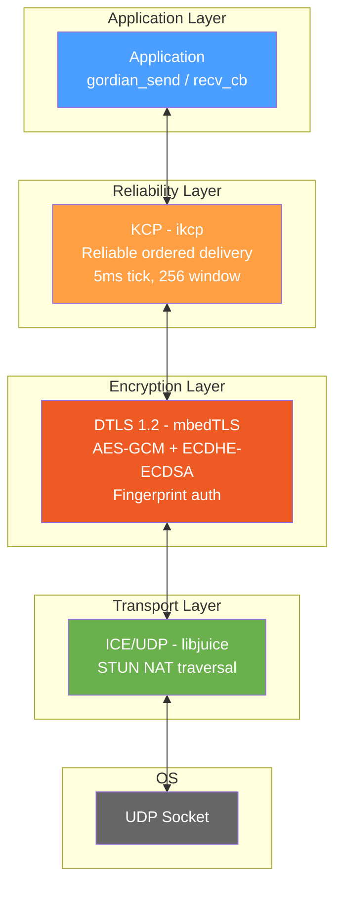
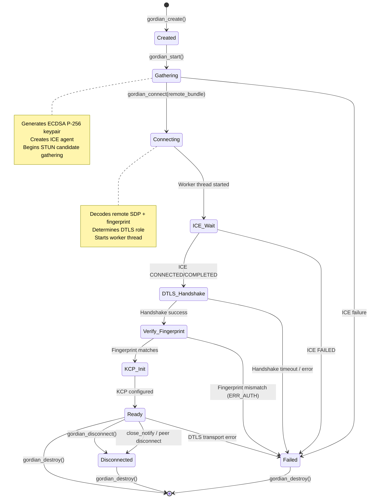
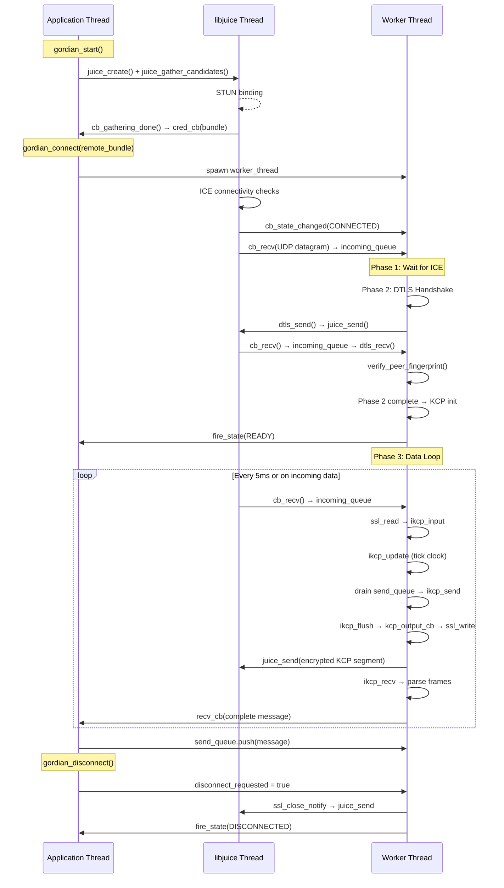
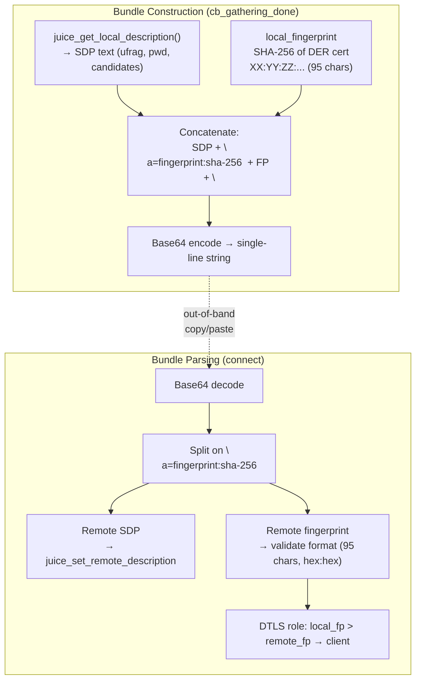

# GordianNet Architecture

## Overview

GordianNet is a lightweight bare-metal P2P link-layer library that establishes
direct, encrypted, reliable connections between two peers over UDP. It requires
no signalling server beyond a STUN service for NAT traversal; peers exchange
opaque "bundles" out-of-band (copy/paste, QR code, etc.).

## Protocol Stack

```
+---------------------------------------------------+
|              Application (gordian_send / recv_cb)  |
+---------------------------------------------------+
|  KCP  (ikcp)                                      |
|  Reliable, ordered, low-latency stream delivery   |
|  Conv=0, stream mode, 5ms tick, 256-window        |
+---------------------------------------------------+
|  DTLS 1.2  (mbedTLS 2.28)                         |
|  AES-128/256-GCM, ECDHE-ECDSA, P-256 certs       |
|  Fingerprint-based mutual authentication          |
+---------------------------------------------------+
|  ICE / UDP  (libjuice 1.7)                        |
|  STUN NAT traversal, candidate gathering          |
|  No GLib dependency, thread-per-agent model       |
+---------------------------------------------------+
|              UDP Socket (kernel)                   |
+---------------------------------------------------+
```



## Connection Lifecycle



## Threading Model



## Data Flow (Send Path)


## Data Flow (Receive Path)


## Bundle Format

The "bundle" is the opaque credential blob exchanged out-of-band between peers.

```
Bundle = Base64( SDP_text + "\na=fingerprint:sha-256 " + fingerprint_hex + "\n" )
```



## DTLS Role Determination

Both peers generate ephemeral ECDSA P-256 certificates at startup. The DTLS
client/server role is deterministic and requires no negotiation:

```
if (local_fingerprint > remote_fingerprint)  →  DTLS client
if (local_fingerprint < remote_fingerprint)  →  DTLS server
if (local_fingerprint == remote_fingerprint) →  ERROR (collision)
```

The lexicographic comparison of the SHA-256 hex strings ("XX:YY:...") provides
a stable, symmetric tie-breaker. Both peers independently arrive at the same
role assignment without any additional signalling.

## KCP Framing

Messages are framed with a 4-byte big-endian length prefix before entering KCP:

```
+----------+-------------------+
| len (4B) | payload (len B)   |
+----------+-------------------+
  BE uint32   application data
```

KCP operates in stream mode (`kcp->stream = 1`), which means multiple
`ikcp_send` calls are concatenated into a continuous byte stream. The
length-prefix framing allows the receiver to reconstruct message boundaries.

### Large Message Chunking

`ikcp_send` rejects calls where `ceil(len / mss) >= 128` (hardcoded
`IKCP_WND_RCV` in ikcp.c), even in stream mode. Messages are chunked into
at most `127 * kcp->mss` bytes per `ikcp_send` call. KCP's stream mode
reassembles them transparently on the receive side.

## File Layout

```
GordianNet/
├── include/
│   └── gordian_net.h          # Public C99 API (opaque GordianNode*)
├── src/
│   ├── gordian_node.hpp       # Internal C++ class definition
│   └── gordian_node.cpp       # Full implementation + extern "C" bridge
├── cli/
│   └── main.cpp               # Interactive P2P chat demo
├── tests/
│   ├── loopback_test.cpp      # Two-node in-process round-trip test
│   ├── framing_test.cpp       # Large message framing test
│   ├── error_path_test.cpp    # Invalid input / error path coverage
│   ├── concurrent_send_test.cpp # Multi-threaded send stress test
│   └── shutdown_test.cpp      # Graceful shutdown test
├── vendor/
│   ├── ikcp.c                 # KCP vendored source
│   └── ikcp.h                 # KCP vendored header
├── docs/
│   ├── ARCHITECTURE.md        # This file
│   └── SECURITY.md            # Threat model and hardening notes
├── CMakeLists.txt             # Build system
├── Doxyfile                   # Doxygen configuration
└── gordian_net.pc.in          # pkg-config template
```

## Build Dependencies

| Dependency | Version | Source       | Purpose              |
|------------|---------|-------------|----------------------|
| libjuice   | 1.7.0   | FetchContent | ICE/STUN             |
| mbedTLS    | 2.28.x  | System pkg   | DTLS 1.2 encryption  |
| ikcp       | vendored| vendor/      | Reliable delivery    |
| CMake      | >= 3.16 | System       | Build system         |
